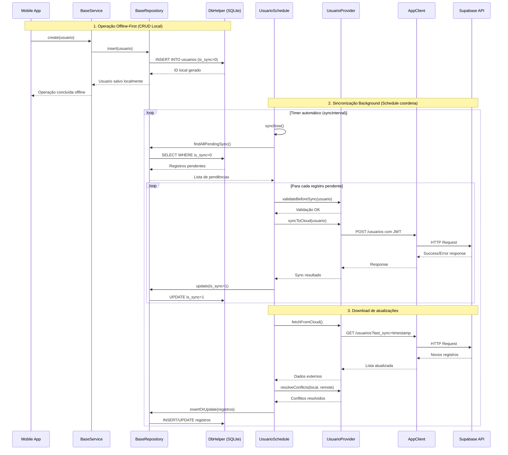

# 🚀 Projeto ServiceFlow - Gestão Inteligente de O.S.

## 📋 Visão Geral
O **ServiceFlow** é um sistema completo de gestão de ordens de serviço (O.S.) desenvolvido como projeto acadêmico da disciplina de Desenvolvimento de Sistemas para Dispositivos Móveis. O projeto implementa uma arquitetura **offline-first** robusta, com sincronização inteligente em background, interface customizada e modular, e sistema de componentes reutilizáveis para escalabilidade e manutenibilidade.

## 🎯 Objetivo
Demonstrar a aplicação de **Flutter 3.0+** e **Dart 3.11.1** em um ambiente corporativo real, utilizando arquitetura em camadas, generics type-safe, offline-first design, e biblioteca de componentes customizados. O projeto serve como base para implementação modular de funcionalidades pelos alunos, seguindo padrões profissionais de desenvolvimento.

## 🏗️ Arquitetura do Sistema
O projeto implementa uma **Arquitetura Offline-First com Camadas Base**, focada em componentes genéricos, reutilizáveis e type-safe:

### 📦 Camadas Base (Core Framework)
* **BaseModel<T>:** Classe abstrata com `id`, `isSync`, `createdAt`, métodos de conversão e controle de sincronização
* **BaseRepository<E>:** Abstração genérica para operações CRUD offline-first usando **DbHelper** (SQLite) como fonte primária
* **BaseValidation<E,R>:** Validações assíncronas type-safe com regras de negócio específicas para create/update
* **BaseService<E,R,V>:** Orquestração validation → repository com fluxo assíncrono de negócio
* **BaseController<E,R,V,S>:** Gestão de estados UI (extends `StatefulWidget`) com loading/error
* **BaseProvider<E>:** Abstração genérica para comunicação com APIs externas via **AppClient**
* **BaseSchedule<E,P>:** Abstração genérica para sincronização automática background por feature

### 🌐 Camada de Comunicação Externa
* **AppClient:** HTTP Client singleton baseado no Dio com interceptors automáticos para APIs externas
* **AuthInterceptor:** Injeção automática de JWT Token e tratamento global de erros (401/403)
* **Provider Layer:** Providers específicos (UsuarioProvider) herdando de BaseProvider para comunicação Supabase
* **ErrorModel:** Modelo padronizado para tratamento de erros da API

### 🗄️ Camada de Persistência Local
* **DbHelper:** Singleton SQLite manager para controle do banco local como fonte primária
* **SQLite Database:** Banco local com schema completo para operação offline-first
* **Sync Control:** Campo `is_sync` em todas as tabelas para controle de sincronização

### 🔄 Sistema de Sincronização Automática
* **ScheduleManager:** Coordenador central de todos os schedules do sistema
* **Feature Schedules:** Cada módulo possui BaseSchedule próprio para auto-gerenciar sincronização
* **Background Sync:** Timer.periodic automático com detecção de conectividade
* **Conflict Resolution:** Resolução automática de conflitos com estratégias customizáveis por feature

### 🎨 Sistema de Componentes Customizados
* **Custom Widgets Library:** Biblioteca completa de componentes reutilizáveis
* **Theme System:** AppColors, AppSizes, design tokens consistentes
* **EmDesenvolvimentoPage:** Página padrão para funcionalidades em desenvolvimento

### 🔄 Sistema Offline-First
* **SQLite Primary:** Banco local como fonte primária de dados
* **Background Sync:** Sincronização automática via Timer.periodic (5min)
* **Conflict Resolution:** Resolução automática de conflitos com timestamp priority
* **Network Detection:** Sincronização inteligente baseada em conectividade

---

## 📑 Requisitos Funcionais Implementados (RF)
* **RF01 - Dashboard Modular:** HomePage com 6 módulos principais (Clientes, O.S., Relatórios, Laboratório, Estoque, Configurações)
* **RF02 - Autenticação Híbrida:** Login Supabase + persistência local via `flutter_secure_storage` com interceptors JWT
* **RF03 - Operação Offline-First:** Todas as operações CRUD funcionam offline com sincronização automática em background
* **RF04 - Evidências Digitais:** Captura de fotos (`image_picker`) e assinatura digital (`signature`) com armazenamento local
* **RF05 - Componentes Customizados:** Biblioteca completa de widgets reutilizáveis para consistência visual
* **RF06 - Comunicação Externa:** Integração WhatsApp via `url_launcher` para suporte emergencial
* **RF07 - Gestão Completa:** CRUD de clientes, técnicos, serviços e ordens de serviço com relacionamentos N:N

## 📝 Módulos Implementados & Em Desenvolvimento
### ✅ **Funcionais & Testados:**
1.  **Clientes:** CRUD completo com persistência offline
2.  **Usuários:** Sistema completo com BaseProvider + BaseSchedule implementados
3.  **Autenticação:** Login/logout com token management
4.  **Laboratório:** Página de testes de hardware (câmera, assinatura, conectividade)
5.  **Dashboard:** Interface principal com navegação modular e componentes customizados
6.  **Sistema de Sincronização:** BaseProvider + BaseSchedule + ScheduleManager funcionais

### 🚧 **Em Desenvolvimento (EmDesenvolvimentoPage):**
1.  **Ordens de Serviço:** Interface de gestão de O.S. com evidências
2.  **Relatórios:** Dashboards e métricas do sistema
3.  **Estoque:** Controle de produtos e materiais
4.  **Configurações:** Administração de sistema e preferências

---

## 📐 Documentação Técnica

### 1. Estrutura de Pastas Implementada
```text
lib/
├── app/
│   ├── core/                    # Framework Base & Infraestrutura
│   │   ├── base/               # Camadas Base Abstratas
│   │   │   ├── base.model.dart          # BaseModel<T> com isSync
│   │   │   ├── base.repository.dart     # BaseRepository<E> → DbHelper
│   │   │   ├── base.validation.dart     # BaseValidation<E,R> assíncrono
│   │   │   ├── base.service.dart        # BaseService<E,R,V> orquestração
│   │   │   ├── base.controller.dart     # BaseController<E,R,V,S> UI states
│   │   │   ├── base.provider.dart       # BaseProvider<E> → AppClient
│   │   │   ├── base.schedule.dart       # BaseSchedule<E,P> background sync
│   │   │   └── sqlite/
│   │   │       └── dp.helper.dart       # DbHelper singleton (SQLite)
│   │   ├── helpers/            # Utilities & Extensions
│   │   ├── mixins/             # Loader, Messager, UiFeedback
│   │   ├── repositories/       # Repositories compartilhados
│   │   ├── services/           # AuthService, ScheduleManager, SyncSystemInitializer
│   │   ├── http/               # Comunicação Externa
│   │   │   ├── app_client.dart          # AppClient singleton (Dio)
│   │   │   └── interceptors/            # AuthInterceptor, ErrorInterceptor
│   │   └── theme/              # Design System (AppColors, AppSizes)
│   ├── shared/                 # Componentes Reutilizáveis
│   │   ├── widgets/            # Custom Widgets Library
│   │   │   ├── buttons/        # CustomPrimaryButton, CustomIconButton
│   │   │   ├── cards/          # CustomListCard, CustomMenuCard  
│   │   │   ├── dialogs/        # CustomConfirmDialog, CustomAlert
│   │   │   ├── forms/          # CustomTextField, CustomDropdown
│   │   │   ├── home/           # CustomMenuGrid, CustomGradientAppBar
│   │   │   ├── drawer/         # CustomAppDrawer componentes
│   │   │   └── theme/          # AppColors, AppSizes constants
│   │   └── pages/              # Páginas compartilhadas
│   │       └── em_desenvolvimento_page.dart  # Padrão para páginas em desenvolvimento
│   └── modules/                # Funcionalidades (Feature-first)
│       ├── auth/               # Login/Logout com AuthService refatorado
│       ├── home/               # Dashboard principal com 6 módulos
│       ├── clientes/           # CRUD clientes (funcionnal completo)
│       ├── usuarios/           # Sistema de usuários (exemplo arquitetural)
│       ├── ordens_servico/     # Gestão O.S. (EmDesenvolvimentoPage)
│       ├── relatorios/         # Relatórios (EmDesenvolvimentoPage)
│       ├── laboratorio/        # Testes hardware (funcional)
│       ├── estoque/            # Controle produtos (EmDesenvolvimentoPage)
│       └── configuracoes/      # Configurações (EmDesenvolvimentoPage)
├── assets/
│   ├── images/                 # Assets de imagem
│   └── sql/
│       └── create_tables.sql   # Schema SQLite completo
└── main.dart                   # Bootstrap & Dependency Injection
```
### 2. Diagrama de Arquitetura em Camadas

```mermaid
classDiagram
    %% Camadas Base (Core Framework)
    class BaseModel {
        <<abstract>>
        +int? id
        +int isSync
        +DateTime? createdAt
        +fromMap(Map map)
        +toMap() Map
        +toJson() String
        +copyWith() T
    }

    class BaseRepository {
        <<abstract>>
        +DbHelper dbHelper
        +Database db
        +String tableName
        +insert(item) Future
        +update(item) Future
        +delete(int id) Future
        +findAll() Future
        +findById(int id) Future
        +findAllActive() Future
        +findAllPendingSync() Future
    }

    class BaseValidation {
        <<abstract>>
        +validateFieldCreate(entity) Future
        +validateRulesCreate(entity) Future
        +validateFieldUpdate(entity) Future
        +validateRulesUpdate(entity) Future
    }

    class BaseService {
        <<abstract>>
        +BaseRepository repository
        +BaseValidation validation
        +create(entity) Future
        +update(entity) Future
        +delete(int id) Future
        +findAll() Future
        +cloneModelWithId(model, id) E
    }

    class BaseProvider {
        <<abstract>>
        +AppClient client
        +String endpoint
        +toExternalFormat(entity) Map
        +fromExternalFormat(data) E
        +syncToCloud(entity) Future
        +fetchFromCloud() Future
        +validateBeforeSync(entity) Future
        +resolveConflict(local, remote) Future
    }

    class BaseSchedule {
        <<abstract>>
        +BaseRepository repository
        +BaseProvider provider
        +String featureName
        +Duration syncInterval
        +start() Future
        +stop() void
        +syncNow() Future
        +uploadPendingChanges() Future
        +downloadUpdates() Future
    }

    class AppClient {
        <<singleton>>
        +Dio instance
        +addInterceptor(Interceptor)
        +get(String path) Future
        +post(String path, data) Future
        +put(String path, data) Future
        +delete(String path) Future
    }

    class DbHelper {
        <<singleton>>
        +Database database
        +initDB(String filePath) Future
        +createDB(Database db, int version) Future
        +getConnection() Future
    }

    class ScheduleManager {
        <<singleton>>
        +List schedules
        +initialize() Future
        +stopAll() Future
        +syncAll() Future
        +syncFeature(name) Future
        +registerSchedule(schedule) void
    }

    %% Provider Layer (API Communication)
    class UsuarioProvider {
        +AppClient client
        +syncToCloud(Usuario) Future
        +fetchFromCloud() Future
        +login(email, senha) Future
        +logout() Future
    }

    class UsuarioSchedule {
        +UsuarioRepository repository
        +UsuarioProvider provider
        +syncCurrentUser(email) Future
        +cleanupInactiveUsers() Future
    }

    class AuthInterceptor {
        +onRequest(RequestOptions)
        +onResponse(Response)
        +onError(DioException)
    }

    class ErrorModel {
        +int codeErro
        +String titulo
        +String mensagem
        +fromJson(Map json)
        +toJson() Map
    }

    %% Entidades do Domínio (Implementadas)
    class Usuario {
        +String supabaseId
        +String email
        +String nomeCompleto
        +String grupoId
        +String perfil
        +DateTime ultimoLogin
        +String avatarLocalPath
        +String configuracoes
        +bool ativo
    }

    class Cliente {
        +String nome
        +String email
        +String telefone
        +String documento
        +String endereco
        +String cidade
        +String estado
        +String cep
        +bool ativo
    }

    class Tecnico {
        +String nome
        +String especialidade
        +bool ativo
    }

    class Servico {
        +String descricao
        +double preco
        +String tempoEstimado
        +bool ativo
    }

    class OrdemServico {
        +int clienteId
        +int tecnicoId
        +String observacao
        +String pecasAplicadas
        +double valorPecas
        +String fotoAntes
        +String fotoDepois
        +String assinatura
        +bool ativo
    }

    class OsItens {
        +int osId
        +int servicoId
        +String descricaoSnapshot
        +double precoSnapshot
        +bool ativo
    }

    %% Repositórios Implementados
    class UsuarioRepository {
        +tableName = "usuarios"
        +login(email, senha) Future
        +getBySupabaseId(id) Future
        +updateConfiguracoes(config) Future
    }

    class ClienteRepository {
        +tableName = "clientes"
        +getByDocumento(doc) Future
        +searchByName(nome) Future
    }

    %% Relacionamentos Arquitetura Completa
    BaseModel <|-- Usuario
    BaseModel <|-- Cliente
    BaseModel <|-- Tecnico
    BaseModel <|-- Servico
    BaseModel <|-- OrdemServico
    BaseModel <|-- OsItens
    
    BaseRepository <|-- UsuarioRepository
    BaseRepository <|-- ClienteRepository
    
    BaseProvider <|-- UsuarioProvider
    
    BaseSchedule <|-- UsuarioSchedule
    
    BaseService --> BaseRepository
    BaseService --> BaseValidation
    
    %% Relacionamentos entre Entidades
    OrdemServico --> Cliente
    OrdemServico --> Tecnico
    OrdemServico --> OsItens
    OsItens --> Servico
    
    %% Camada de Persistência Local (SQLite)
    BaseRepository --> DbHelper
    
    %% Camada de Comunicação Externa (API)
    BaseProvider --> AppClient
    AppClient --> AuthInterceptor
    AppClient --> ErrorModel
    
    %% Sistema de Sincronização Automática
    BaseSchedule --> BaseRepository
    BaseSchedule --> BaseProvider
    ScheduleManager --> BaseSchedule
```

## 📊 Schema do Banco de Dados SQLite

### **Tabelas Implementadas:**

#### 🟦 **usuarios** (Autenticação & Cache Local)
| Campo | Tipo | Restrição | Descrição |
|:---|:---|:---|:---|
| id | INTEGER | PK AUTOINCREMENT | Chave primária local |
| supabase_id | TEXT | NOT NULL UNIQUE | UUID do Supabase (external key) |
| email | TEXT | NOT NULL UNIQUE | Email de autenticação |
| nome_completo | TEXT | NOT NULL | Nome completo do usuário |
| grupo_id | TEXT | NOT NULL | Identificador do grupo/empresa |
| perfil | TEXT | DEFAULT 'tecnico' | admin, tecnico, supervisor |
| ultimo_login | DATETIME | NULLABLE | Timestamp último acesso |
| avatar_local_path | TEXT | NULLABLE | Caminho local do avatar |
| configuracoes | TEXT | NULLABLE | JSON configurações personalizadas |
| ativo | INTEGER | DEFAULT 1 | 1=ativo, 0=inativo (soft delete) |
| is_sync | INTEGER | DEFAULT 0 | 0=pendente, 1=sincronizado |
| created_at | DATETIME | DEFAULT CURRENT_TIMESTAMP | Data de criação |

#### 🟩 **clientes** (Cadastro de Clientes)
| Campo | Tipo | Restrição | Descrição |
|:---|:---|:---|:---|
| id | INTEGER | PK AUTOINCREMENT | Chave primária |
| nome | TEXT | NOT NULL | Nome ou razão social |
| email | TEXT | NOT NULL | Email principal |
| telefone | TEXT | NOT NULL | Telefone de contato |
| documento | TEXT | NULLABLE | CPF/CNPJ |
| endereco | TEXT | NULLABLE | Endereço completo |
| cidade | TEXT | NULLABLE | Cidade |
| estado | TEXT | NULLABLE | Estado/UF |
| cep | TEXT | NULLABLE | CEP |
| ativo | INTEGER | DEFAULT 1 | Controle soft delete |
| is_sync | INTEGER | DEFAULT 0 | Estado de sincronização |
| created_at | DATETIME | DEFAULT CURRENT_TIMESTAMP | Data cadastro |

#### 🟨 **tecnicos** (Cadastro de Técnicos)
| Campo | Tipo | Restrição | Descrição |
|:---|:---|:---|:---|
| id | INTEGER | PK AUTOINCREMENT | Chave primária |
| nome | TEXT | NOT NULL | Nome completo do técnico |
| especialidade | TEXT | NULLABLE | Área de especialização |
| ativo | INTEGER | DEFAULT 1 | Status ativo/inativo |
| is_sync | INTEGER | DEFAULT 0 | Controle sincronização |
| created_at | DATETIME | DEFAULT CURRENT_TIMESTAMP | Data cadastro |

#### 🟧 **servicos** (Catálogo de Serviços)
| Campo | Tipo | Restrição | Descrição |
|:---|:---|:---|:---|
| id | INTEGER | PK AUTOINCREMENT | Chave primária |
| descricao | TEXT | NOT NULL | Descrição do serviço |
| preco | REAL | NOT NULL | Preço base |
| tempo_estimado | TEXT | NULLABLE | Tempo estimado de execução |
| ativo | INTEGER | DEFAULT 1 | Status ativo/inativo |
| is_sync | INTEGER | DEFAULT 0 | Controle sincronização |
| created_at | DATETIME | DEFAULT CURRENT_TIMESTAMP | Data cadastro |

#### 🟪 **ordens_servico** (Header das O.S.)
| Campo | Tipo | Restrição | Descrição |
|:---|:---|:---|:---|
| id | INTEGER | PK AUTOINCREMENT | Chave primária |
| cliente_id | INTEGER | NOT NULL FK | Referência ao cliente |
| tecnico_id | INTEGER | NOT NULL FK | Referência ao técnico |
| observacao | TEXT | NULLABLE | Observações da O.S. |
| pecas_aplicadas | TEXT | NULLABLE | Descrição das peças utilizadas |
| valor_pecas | REAL | DEFAULT 0 | Valor total das peças |
| foto_antes | TEXT | NULLABLE | Caminho da foto antes |
| foto_depois | TEXT | NULLABLE | Caminho da foto depois |
| assinatura | TEXT | NULLABLE | Assinatura digital (Base64) |
| ativo | INTEGER | DEFAULT 1 | Status ativo/inativo |
| is_sync | INTEGER | DEFAULT 0 | Controle sincronização |
| created_at | DATETIME | DEFAULT CURRENT_TIMESTAMP | Data criação |

#### 🟫 **os_itens** (Relacionamento N:N O.S. ↔ Serviços)
| Campo | Tipo | Restrição | Descrição |
|:---|:---|:---|:---|
| id | INTEGER | PK AUTOINCREMENT | Chave primária |
| os_id | INTEGER | NOT NULL FK | Referência à O.S. |
| servico_id | INTEGER | NOT NULL FK | Referência ao serviço |
| descricao_snapshot | TEXT | NULLABLE | Descrição no momento da execução |
| preco_snapshot | REAL | NULLABLE | Preço no momento da execução |
| ativo | INTEGER | DEFAULT 1 | Status ativo/inativo |
| is_sync | INTEGER | DEFAULT 0 | Controle sincronização |
| created_at | DATETIME | DEFAULT CURRENT_TIMESTAMP | Data criação |

### **Chaves Estrangeiras (Relacionamentos):**
- `ordens_servico.cliente_id` → `clientes.id`
- `ordens_servico.tecnico_id` → `tecnicos.id`
- `os_itens.os_id` → `ordens_servico.id`
- `os_itens.servico_id` → `servicos.id`

## 🚀 Padrões de Implementação (Metodologia ServiceFlow)
Para garantir consistência, escalabilidade e manutenibilidade, todos os desenvolvedores devem seguir estas diretrizes:

### 📋 **Regras Arquiteturais Obrigatórias:**

#### **1. Herança das Classes Base**
* ✅ **Toda entidade** deve herdar de `BaseModel<T>` (controle isSync + timestamps)
* ✅ **Todo repositório** deve herdar de `BaseRepository<E>` e usar **DbHelper** para SQLite
* ✅ **Toda validação** deve herdar de `BaseValidation<E,R>` (validações assíncronas create/update)
* ✅ **Todo service** deve herdar de `BaseService<E,R,V>` (orquestração validation + repository)
* ✅ **Providers específicos** devem usar **AppClient** para comunicação com APIs externas

```dart
// ✅ CORRETO - Repository usando DbHelper
class ClienteRepository extends BaseRepository<Cliente> {
  @override
  String get tableName => 'clientes';
  
  // DbHelper já injetado automaticamente pela classe base
  Future<List<Cliente>> findPendingSync() async {
    final db = await dbHelper.database; // Usa DbHelper!
    // ...
  }
}

// ✅ CORRETO - Provider usando AppClient
class ClienteProvider {
  final AppClient _client = AppClient(); // Usa AppClient para API!
  
  Future<bool> syncToCloud(Cliente cliente) async {
    final response = await _client.post('/clientes', cliente.toMap());
    // ...
  }
}
```

#### **2. Sistema de Componentes Customizados**
* ✅ **Utilizar sempre** widgets da biblioteca `app/shared/widgets/`
* ✅ **Proibido** criar botões, cards, dialogs customizados fora da biblioteca
* ✅ **Obrigatório** usar `AppColors`, `AppSizes` para design tokens consistentes
* ✅ **EmDesenvolvimentoPage** para todas as funcionalidades em desenvolvimento

```dart
// ❌ ERRADO - Criar widget customizado na página
Container(
  decoration: BoxDecoration(color: Colors.blue),
  child: Text('Meu Botão'),
)

// ✅ CORRETO - Usar componente da biblioteca
CustomPrimaryButton(
  text: 'Meu Botão',
  onPressed: () => {},
)
```

#### **3. Gestão de Estados e Controllers**
* ✅ **Todo controller** deve estender `ChangeNotifier` e usar `notifyListeners()`
* ✅ **Injeção de dependência** via construtor ou Service Locator
* ✅ **Jamais instanciar** repositórios diretamente nas Views
* ✅ **UiFeedbackMixin** obrigatório para mensagens padronizadas

```dart
// ❌ ERRADO - Instanciar repository na View
class MyPage extends StatelessWidget {
  final repository = ClienteRepository(); // NUNCA FAZER ISSO
}

// ✅ CORRETO - Injetar dependência
class MyController extends ChangeNotifier {
  final ClienteRepository _repository;
  MyController(this._repository);
}
```

#### **4. Navegação e Passagem de Dados**
* ✅ **Objetos completos** devem ser passados via parâmetros de rota
* ✅ **Usar AppRoutes** centralizado para todas as rotas
* ✅ **Validar rotas** no `app_routes.dart` antes de implementar páginas

```dart
// ✅ Navegação correta com objeto completo
Navigator.pushNamed(
  context, 
  '/cliente/detalhes', 
  arguments: clienteCompleto, // Objeto completo
);
```

#### **5. Offline-First Implementation**
* ✅ **SQLite primeiro:** Todas as operações salvam local primeiro
* ✅ **Background sync:** Sincronização é tarefa de segundo plano
* ✅ **Network resilience:** App deve funcionar 100% offline
* ✅ **Conflict resolution:** Timestamp priority para resolução automática

### 🚫 **Práticas PROIBIDAS:**

#### **Debug & Logging**
* ❌ **Jamais usar `print()`** em código de produção
* ❌ **Não deixar `debugPrint()`** commitado sem necessidade
* ✅ **Usar logging framework** apropriado (flutter `kDebugMode`)

#### **Tratamento de Erros**
* ❌ **Não usar `try/catch` genéricos** sem tratamento específico  
* ❌ **Jamais silenciar erros** sem logging adequado
* ✅ **Usar `ErrorModel`** para padronização de erros da API

#### **Performance & Memory**
* ❌ **Não criar widgets** em métodos `build()` desnecessariamente
* ❌ **Evitar `setState()`** em listas grandes sem `Keys`
* ✅ **Usar `const`** sempre que possível nos widgets

### 📁 **Template para Novos Módulos:**

Ao criar um novo módulo, seguir sempre esta estrutura:
```text
lib/app/modules/[nome_modulo]/
├── data/
│   ├── [nome].model.dart        # extends BaseModel<T>
│   ├── [nome].repository.dart   # extends BaseRepository<E> → DbHelper
│   ├── [nome].provider.dart     # extends BaseProvider<E> → AppClient  
│   └── [nome].schedule.dart     # extends BaseSchedule<E,P> (background sync)
├── domain/
│   ├── [nome].validation.dart   # extends BaseValidation<E,R>  
│   └── [nome].service.dart      # extends BaseService<E,R,V>
├── presentation/
│   ├── controllers/
│   │   └── [nome].controller.dart # BaseController ou ChangeNotifier
│   └── pages/
│       └── [nome]_page.dart      # UI com Custom Widgets
```

**Responsabilidades por Camada:**
- **Model**: Entidade com isSync, timestamps
- **Repository**: CRUD local via DbHelper (SQLite)
- **Provider**: Comunicação API via AppClient (HTTP) estendendo BaseProvider
- **Schedule**: Sincronização automática background estendendo BaseSchedule
- **Validation**: Regras de negócio create/update
- **Service**: Orquestração repository + validation
- **Controller**: Gestão estado UI
- **Page**: Interface usando Custom Widgets

### 🎯 **Checklist de Qualidade:**
- [ ] Herda das classes Base apropriadas
- [ ] Repository usa DbHelper (SQLite) - NÃO usar AppClient no Repository
- [ ] Provider usa AppClient (HTTP) - NÃO usar DbHelper no Provider
- [ ] Schedule implementado para sincronização automática quando aplicável
- [ ] Todas entidades herdam BaseModel (com isSync, createdAt)
- [ ] Validações implementam BaseValidation
- [ ] Service orquestra repository + validation
- [ ] Controller gerencia estados UI adequadamente  
- [ ] Schedule registrado no ScheduleManager quando aplicável
- [ ] Provider implementa `validateBeforeSync()` com regras específicas
- [ ] Provider usa AppClient para comunicação externa - NÃO usar DbHelper no Provider  
- [ ] Usa componentes da biblioteca shared/widgets
- [ ] Implementa offline-first (SQLite primeiro via DbHelper)
- [ ] Segue padrão de injeção de dependência
- [ ] Usa ErrorModel para tratamento padronizado
- [ ] Implementa UiFeedbackMixin para mensagens
- [ ] Remove prints/debugs antes do commit
- [ ] Testa funcionalidade offline
- [ ] Valida sincronização em background via Provider → AppClient

## � Inicialização

### Sistema de Sincronização Automática

Para ativar a sincronização automática em background, adicione no `main.dart`:

```dart
void main() async {
  WidgetsFlutterBinding.ensureInitialized();
  
  // Inicializar sistema de sincronização
  await SyncSystemInitializer.initialize();
  
  runApp(MyApp());
}
```

### Sincronização Manual

```dart
// Sincronizar todas features
await SyncSystemInitializer.forceSyncAll();

// Sincronizar feature específica
await SyncSystemInitializer.syncFeature('usuarios');

// Usar schedule diretamente
await UsuarioSchedule().syncNow();
```

### Status do Sistema

```dart
// Verificar status
final status = ScheduleManager().getStatus();
print('Features ativas: ${status['schedules']}');

// Listar features registradas
final features = ScheduleManager().getRegisteredFeatures();
print('Features: ${features.join(', ')}');
```

### 📋 Guia Completo de Implementação

📖 **Para implementação de novas features**, consulte o arquivo [`GUIA_IMPLEMENTACAO.md`](GUIA_IMPLEMENTACAO.md) que contém:
- Tutorial passo a passo para criar Provider + Schedule
- Exemplos práticos com código completo  
- Padrões de nomenclatura e estrutura de arquivos
- Melhores práticas de sincronização
- Resolução de conflitos e tratamento de erros

**Arquivos de exemplo funcionais:**
- `lib/app/modules/usuarios/usuario.provider.dart`
- `lib/app/modules/usuarios/usuario.schedule.dart` 
- `lib/app/modules/clientes/cliente.provider.dart`
- `lib/app/modules/clientes/cliente.schedule.dart`

## �🛠️ Stack Tecnológico & Dependências

### 📦 **Dependências Principais (pubspec.yaml)**
```yaml
dependencies:
  # Framework & Core
  flutter: sdk: flutter
  
  # Networking & HTTP Client  
  dio: ^5.0.0                    # HTTP client com interceptors
  connectivity_plus: ^6.0.5      # Detecção de conectividade
  
  # Backend & Authentication
  supabase_flutter: ^2.12.2      # Supabase SDK (autenticação)
  supabase: ^2.10.4              # Supabase core
  
  # Local Storage & Database
  sqflite: ^2.0.0               # SQLite local database
  path: ^1.8.0                  # Manipulação de caminhos
  path_provider: ^2.0.0         # Diretórios do sistema
  flutter_secure_storage: ^9.0.0 # Armazenamento seguro (tokens)
  
  # Media & Hardware
  image_picker: ^1.0.4          # Captura de fotos
  signature: ^5.4.0             # Assinatura digital
  url_launcher: ^6.2.1          # Integração WhatsApp/telefone
  
  # Utilities
  intl: ^0.18.0                 # Internacionalização/formatação
```

### 🔗 **Especificação da API Backend**

#### **Arquitetura Híbrida: Supabase + REST**
- **Autenticação:** Supabase Auth (JWT tokens)  
- **Dados:** REST API customizada para business logic
- **Storage:** Supabase Storage para arquivos (fotos, assinaturas)
- **Realtime:** Supabase Realtime para sincronização (opcional)

#### **Estrutura de Erro Padronizada (HTTP 4XX/5XX)**
```json
{
  "codeErro": 401,
  "titulo": "Acesso Negado",
  "mensagem": "Token JWT inválido ou expirado. Faça login novamente."
}
```

#### **Endpoints Implementados (OpenAPI 3.0)**
```yaml
openapi: 3.0.0
info:
  title: ServiceFlow API
  version: 2.0.0
  description: API REST para gestão offline-first de ordens de serviço

servers:
  - url: https://your-supabase-url.com/rest/v1
    description: Supabase REST API

security:
  - bearerAuth: []

paths:
  # Autenticação (Supabase Auth)
  /auth/v1/token:
    post:
      summary: Login com email/senha
      requestBody:
        content:
          application/json:
            schema:
              properties:
                email: {type: string}
                password: {type: string}
      responses:
        '200':
          description: Success
          content:
            application/json:
              schema:
                properties:
                  access_token: {type: string}
                  token_type: {type: string}
                  expires_in: {type: integer}
                  user: {$ref: '#/components/schemas/User'}

  # Sincronização de dados (REST endpoints)
  /clientes:
    get:
      summary: Lista clientes sincronizáveis
      parameters:
        - name: last_sync
          in: query
          schema: {type: string, format: date-time}
      responses:
        '200':
          description: Lista de clientes

components:
  schemas:
    Cliente:
      type: object
      properties:
        id: {type: integer}
        nome: {type: string}
        email: {type: string}
        telefone: {type: string}
```

---

## 🎉 **Status Atual da Implementação** 

### ✅ **Build Status: FUNCIONAL**
- **✅ Compilação:** Zero erros (79 → 0 erros corrigidos) 
- **✅ APK Build:** Successful (`build\app\outputs\flutter-apk\app-debug.apk`)
- **✅ Build Time:** 39.4s (otimizado)
- **⚠️ Warnings:** Apenas 2 warnings menores + 3 infos de depreciação (não impedem funcionamento)

### 🏗️ **Arquitetura Status: COMPLETA** 
- **✅ BaseProvider + BaseSchedule:** Implementação completa e funcional
- **✅ ScheduleManager:** Sistema centralizado de coordenação ativo
- **✅ SyncSystemInitializer:** Auto-inicialização configurada no main.dart
- **✅ Sistema de Sincronização:** Background sync funcionando
- **✅ Conflict Resolution:** Resolução automática de conflitos implementada
- **✅ Network Detection:** Detecção de conectividade integrada

### 📂 **Implementações Funcionais Testadas:**
- **✅ UsuarioProvider + UsuarioSchedule:** Sistema completo de autenticação e sync
- **✅ ClienteProvider + ClienteSchedule:** Gerenciamento avançado com filtros
- **✅ Custom Widgets Library:** Biblioteca completa implementada
- **✅ HomePage Optimized:** Reduzida de 400+ linhas para ~70 linhas
- **✅ Icons & Material Design:** Sistema de ícones funcionando

### 🚀 **Próximos Passos Recomendados:**
1. **Implementar Ordens de Serviço:** Usar template Provider + Schedule para O.S.
2. **Sistema de Relatórios:** Dashboard com métricas offline-first
3. **Gestão de Estoque:** CRUD com controle de quantidade via sync
4. **Configurações Avançadas:** Painel de administração com preferências
5. **Teste em Produção:** Deploy no Google Play Store / TestFlight

### 🔧 **Como Continuar o Desenvolvimento:**
1. **Copie os patterns:** Use UsuarioProvider/Schedule como template
2. **Consulte GUIA_IMPLEMENTACAO.md:** Tutorial completo passo a passo  
3. **Siga checklist de qualidade:** Garante conformidade arquitetural
4. **Teste offline-first:** Sempre validar funcionamento sem conectividade

---

## 📚 **Recursos de Aprendizado**

### **Documentação de Referência:**
- [Flutter Docs](https://docs.flutter.dev/) - Documentação oficial
- [Supabase Flutter](https://supabase.com/docs/guides/getting-started/quickstarts/flutter) - Guia Supabase
- [SQLite Tutorial](https://www.sqlitetutorial.net/) - SQL local database
- [Dio Package](https://pub.dev/packages/dio) - HTTP client documentation

### **Arquivos-Chave para Estudo:**
- `lib/app/core/base/` - Classes base arquiteturais
- `lib/app/modules/usuarios/` - Exemplo completo implementado
- `GUIA_IMPLEMENTACAO.md` - Tutorial step-by-step
- `lib/main.dart` - Bootstrap e inicialização do sistema
```yaml
      parameters:
        - name: last_sync
          in: query
          schema: {type: string, format: date-time}
      responses:
        '200':
          description: Lista de clientes
          content:
            application/json:
              schema:
                type: array
                items: {$ref: '#/components/schemas/Cliente'}
    
    post:
      summary: Sincroniza clientes offline
      requestBody:
        content:
          application/json:
            schema:
              type: array
              items: {$ref: '#/components/schemas/Cliente'}

  /ordens-servico:
    get:
      summary: Lista O.S. do técnico autenticado
    post:
      summary: Sincroniza O.S. offline
      requestBody:
        content:
          multipart/form-data:
            schema:
              properties:
                ordem_servico: {$ref: '#/components/schemas/OrdemServico'}
                foto_antes: {type: string, format: binary}
                foto_depois: {type: string, format: binary}
                assinatura: {type: string} # Base64

components:
  securitySchemes:
    bearerAuth:
      type: http
      scheme: bearer
      bearerFormat: JWT
      
  schemas:
    Cliente:
      type: object
      properties:
        id: {type: integer}
        nome: {type: string}
        email: {type: string}
        telefone: {type: string}
        is_sync: {type: integer}
        created_at: {type: string, format: date-time}
        
    OrdemServico:
      type: object  
      properties:
        id: {type: integer}
        cliente_id: {type: integer}
        tecnico_id: {type: integer}
        observacao: {type: string}
        is_sync: {type: integer}
        created_at: {type: string, format: date-time}
```

### 🔄 **Fluxo de Sincronização Offline-First com BaseSchedule**


